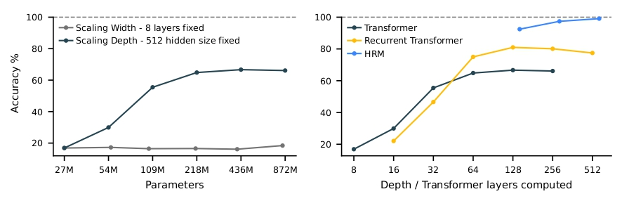
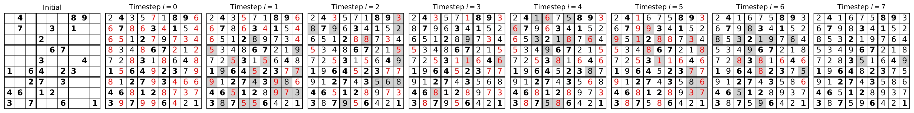
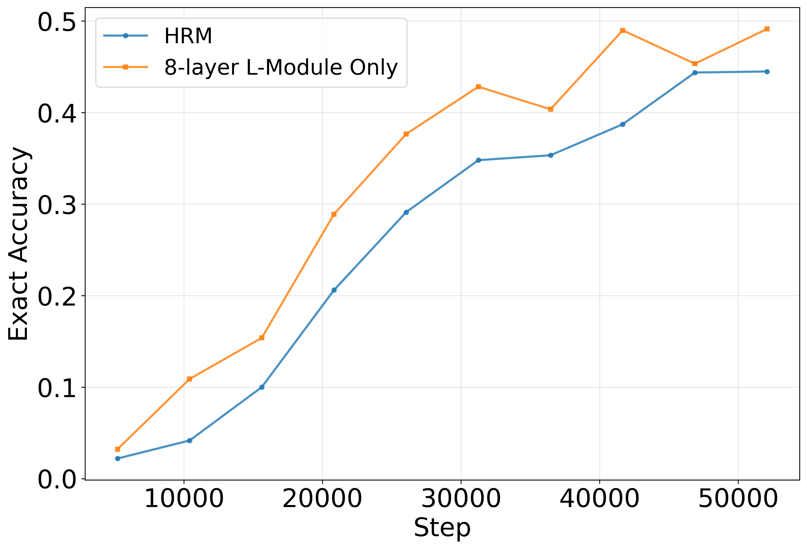
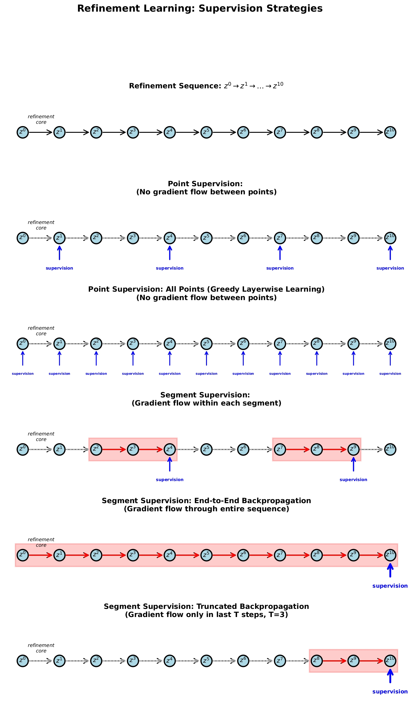
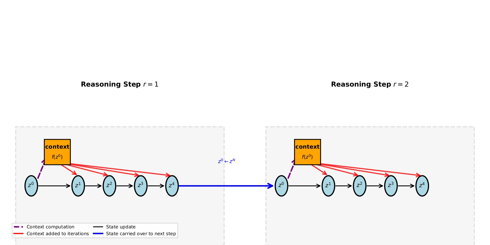

# Can a Neural Network Think Before It Speaks?
Date: March 2, 2026
By Renee Ge*, Qianli Liao*, *Contributed Equally

*An overview of a line of work on latent-space reasoning—covering [Wang et al. (2025)](#hrm), [Ge (2025)](#ge-thesis), [Ge, Liao & Poggio (2025)](#ge-liao), [Jolicoeur-Martineau (2025)](#trm), and [Liao & Poggio (2025)](#srm).*

---

Somewhere around 2022, an observation started making the rounds among researchers working with large language models: if you just asked a model to think out loud before answering, it got dramatically better at hard problems. This technique — Chain-of-Thought (CoT) prompting — felt almost too simple to be real. Suddenly, getting a model to write "let me think step by step..." before answering a math problem improved its accuracy from around 20% to over 80%.

But the more you think about why it works, the stranger it gets. Why does writing things down in natural language help a model reason? The model already has all of that information encoded internally. Writing it out shouldn't add new knowledge — it's just translating the model's own hidden states into words and back again. Yet clearly something useful is happening in that roundtrip through language.

If Chain-of-Thought helps because language is a good medium for reasoning, what does that say about how neural networks think when they *aren't* writing things out? Are they just pattern-matching? Are they reasoning at all?

A cluster of recent papers suggests a different approach entirely — one that's been quietly producing some surprising results. Rather than externalizing reasoning into tokens, these models reason *inward*, iteratively refining a hidden state until they converge on an answer. No intermediate tokens. No chain of thought. Just a network running in circles until it figures something out. And somehow, this works remarkably well.

---

## The Problem with How Transformers Compute

Standard transformers have a fixed computational budget. Every input — whether you're asking "what's 2+2" or "solve this 30×30 maze" — gets exactly the same number of processing layers. This is a strange property for a general reasoning system. Humans do not allocate the same cognitive effort to tying their shoes as to writing a proof. But transformers do.

There are two straightforward ways to increase computation: make the model wider (more parameters per layer) or deeper (more layers). Depth generally helps more than width for reasoning tasks, but scaling depth is a blunt instrument. It increases compute for *all* inputs equally, regardless of difficulty. Even if very deep networks can be trained reliably today, adding layers simply commits you to paying that cost on every forward pass — easy and hard problems alike.

A more appealing alternative is *iterative or adaptive computation*: reuse the same computational block multiple times. Instead of hard-coding depth into the architecture, treat depth as “time.” The model can refine its internal state across multiple steps, potentially allocating more iterations to harder instances. In practice, even running a fixed number of refinement steps already changes the character of computation: the model maintains a structured internal representation of constraints and progressively improves it, rather than attempting to solve the task in a single feedforward sweep.

There's a second problem too, more subtle. Even if you give a model enough computation, where does that computation happen? Chain-of-Thought reasoning is transparent — you can see every step. But it's also slow, brittle, and dependent on reasoning traces for training. More fundamentally, it's not clear that natural language is the right representation for every intermediate step in every kind of problem. When you're solving a Sudoku, you probably don't want to write "okay, so if row 3 can't have a 7..." — you want to maintain some structured representation of constraints and work with that directly.

These two problems together — fixed compute and the wrong representation space — are what a line of recent papers has been trying to solve. The solution they've converged on is: *run the same network over and over again, in latent space, and supervise the intermediate outputs.*

---

## The Hierarchical Reasoning Model

In May 2025, Wang et al. introduced the Hierarchical Reasoning Model (HRM) — a system with two recursive modules that alternate through many "reasoning cycles" before producing a final answer.

A low-level module (L) runs for several steps with the high-level module's state fixed, essentially converging on a local solution given the current context. Then the high-level module (H) takes L's final state, updates its own representation, and the next cycle begins. L then runs again, this time with a shifted context, and potentially a very different trajectory.

The key insight is what this hierarchy prevents. A plain recurrent neural network, if you run it long enough, settles into a fixed point and stops changing. This is death for a reasoning system; once converged, no amount of additional processing does anything useful. The two-level structure in HRM avoids this: every time H updates, it kicks L out of whatever local equilibrium it had reached, forcing a fresh round of processing. The system keeps moving.

Training this kind of model is tricky. Running backpropagation through all the intermediate steps requires storing the entire computational trajectory, which becomes prohibitively expensive. HRM sidesteps this by computing gradients only through the final L and H update within each cycle — a "reduced BPTT" approximation that's much cheaper in practice. This is paired with deep supervision: each reasoning step produces its own prediction and incurs its own loss, so the model gets training signal all the way through.

The results from a model trained *from scratch on roughly 1,000 examples* were striking. On Sudoku-Extreme (where standard CoT baselines fail entirely), HRM solved them reliably. On 30×30 maze navigation, HRM found optimal paths with reasonable accuracy — CoT baselines scored zero. And on ARC-AGI-1, a benchmark specifically designed to test general reasoning, HRM scored 40.3% with only 27 million parameters, outperforming o3-mini-high (34.5%) and Claude 3.7 (21.2%).

Something worth noting: this is a 27 million parameter model, trained from scratch on ~1,000 examples, no pretraining, no chain-of-thought supervision, outperforming systems orders of magnitude larger on a hard reasoning benchmark. The intermediate predictions are interpretable too — in Sudoku, constraint violations gradually disappear across reasoning steps. In mazes, the path incrementally sharpens toward the optimal solution. The model isn't guessing and checking; it's genuinely refining.

***Figure 1 (Wang et al., 2025).** Depth matters; width does not. HRM benchmark comparison.*

***Figure 2 (Wang et al., 2025).** Intermediate Sudoku predictions. Bold = givens; red = violations; grey = changes.*

---

## Is the Hierarchy Actually Necessary?

Once you have a result this surprising, the natural next question is: what's actually doing the work?

The most obvious hypothesis is that the two-module hierarchy is essential — that some clever division of labor between high-level and low-level processing is responsible for the capability. ARC-Foundation (2025) and Ge, Liao & Poggio (2025) tested this directly by comparing HRM against a flat architecture with equivalent total capacity: rather than 4H+4L layers alternating with each other, just 8 L-layers running recursively.

The result: similar performance on Sudoku.

This is a somewhat deflating finding if you were attached to the hierarchical interpretation, but it's actually more interesting than it first appears. It means the hierarchy isn't load-bearing — *iterative refinement* is. The model doesn't need a clever architectural prior about high-level versus low-level processing. It just needs to run the same computation repeatedly, with enough depth to do something useful.

Ge, Liao & Poggio also draw an illuminating comparison to diffusion models. In diffusion, you train a model to denoise a signal one step at a time, with each step independently supervised to move toward the target. HRM's segment-level supervision is structurally identical: each piece of the trajectory learns to map an intermediate state toward the solution, without needing to backpropagate through the whole trajectory. HRM is, in this sense, a diffusion model operating in a discrete latent space.

This analogy explains why the training works without full BPTT. It suggests connections to a broader family of few-step refinement methods, and it points toward what should and shouldn't matter architecturally.

Separately, Renee Ge's thesis work on HRM found that *layer sharing* — having the model reuse the same transformer block across all recursion steps — preserves most of the performance while cutting the parameter count substantially. A 7 million model with one shared block for L and H module respectively matches or slightly exceeds the original 27 million HRM on Sudoku. This is further confirmation that the recursive structure is doing real work.

***Figure 3 (Ge, Liao & Poggio, 2025).** 4H+4L hierarchy vs. flat 8-layer recurrence — similar performance.*

---

## Smaller, Faster, Better

Interestingly, an independent line of work reached a very similar endpoint. Jolicoeur-Martineau (2025) introduces Tiny Recursive Model (TRM), which converges on the same core principle: repeated application of a tiny shared model is sufficient for strong performance.

TRM outperforms HRM with only 7 million parameters, down from 27 million, achieving the same parameter reduction as Ge's thesis. A small shared network, applied recursively, works at least as well as a larger non-shared one, and may generalize better. TRM uses a two-layer network shared across H and L modules and across all recursion steps. The paper also notes that fewer layers can improve generalization on data-scarce benchmarks, possibly by reducing overfitting — the mechanism isn't fully understood, but it's an interesting direction.

Although not highlighted as much as layer-sharing, two factors actually contribute significantly to the superb performance:

The first is architectural. For problems with small, fixed contexts (like 9×9 Sudoku), self-attention is overkill — the relevant relationships are all local and fixed. TRM replaces attention with MLP mixing across the sequence dimension, which turns out to work significantly better for these problems, boosting Sudoku-Extreme accuracy from roughly 75% to roughly 87%. For larger contexts (30×30 mazes), attention still earns its keep.

The second is training regime. Larger minibatches and more training iterations, it turns out, matter a lot — probably more than most architectural details. This is a mundane but important lesson: when you have a small model and a small dataset, the training procedure is load-bearing in a way it isn't for large-scale pretraining.

---

## A Unified Picture

The final paper in this cluster, Liao & Poggio's Simple Recursive Model (SRM), pulls back to ask what all of these methods have in common — and what the simplest version of the underlying idea looks like.

The answer is a framework they call *refinement learning*. Start with an initial state $z^0$ and apply a learned core repeatedly:
$$z^0 \rightarrow z^1 \rightarrow \cdots \rightarrow z^N$$

Training supervision can happen at two levels. *Point supervision* independently targets each $z^i$ — this is what diffusion models do, and roughly what the outer loop of HRM/TRM does. *Segment supervision* lets gradients flow within a block of steps before cutting — this is truncated BPTT, and roughly what the inner loop of HRM/TRM does. HRM, TRM, SRM, and diffusion are all instances of the same two-level structure.

The more interesting contribution is what SRM identifies as the key ingredient that HRM and TRM were using through their two-state design. Both models maintain a second state that carries older information forward, preventing the network from "forgetting" its starting point as it refines. SRM shows this can be replaced by something simpler: a skip connection from the initial state $z^0$, injected into each inner iteration as context.

This single-state model with skip connections matches TRM performance on Sudoku. Remove the skip connections, and performance degrades substantially. The insight is that the model needs persistent access to where it started — not because of some complex hierarchical processing, but simply to avoid drifting too far from the original problem as it iterates.

This is conceptually satisfying. Iterative refinement without a fixed reference point is like navigating in fog without compass — you can travel a long way and end up somewhere arbitrary. Anchoring each iteration to the initial state keeps the refinement targeted.

***Figure 4 (Liao & Poggio, 2025).** Point vs. segment supervision.*

***Figure 5 (Liao & Poggio, 2025).** Skip connections from initial state $z^0$ of every segment injected into each inner iteration.*

---

## Where This Points

The picture that emerges from this line of work is fairly clear. You don't need Chain-of-Thought to build systems that reason deeply. You don't need hierarchy, or architectural cleverness, or large parameter counts, or even large training sets. What you need is:

1. **Iterative refinement** in latent space — run the same computation repeatedly until convergence.
2. **Frequent supervision** — give the model training signal at intermediate steps, not just the end.
3. **Access to context** — either a second state or skip connections to the initial representation.
4. **Enough depth** — scaling effective depth (more iterations) helps more than scaling width.

The connection to diffusion models is worth taking seriously. Diffusion has become the dominant paradigm for image generation precisely because it decouples the difficulty of learning a full generative model from the simpler problem of learning a one-step refinement. The same logic applies here: learning to improve an answer is easier than learning to produce a correct answer from scratch, and you can iterate the improvement as many times as needed.

There's also an older lineage worth acknowledging. Liao & Poggio (2016) showed that deep residual networks can be interpreted as unrolled recurrent computations — weight-shared RNNs, essentially. Jastrzębski et al. (2017) made the refinement interpretation explicit: residual connections encourage later blocks to behave like iterative inference steps, progressively nudging representations toward the solution. The models reviewed here are in some sense the natural endpoint of that interpretation taken seriously.

The open questions are interesting. Can this approach scale to problems that require language — not just structured puzzles? The current results are on Sudoku, mazes, and ARC-AGI, which all have clean target representations. It's less obvious how refinement learning interacts with the messiness of natural language generation, where there isn't a single "correct" latent state to converge toward.

There's also the question of what happens at scale. HRM and TRM are impressive for their size, but they're tiny compared to frontier language models. Do the scaling laws change when you add iterative refinement? Does effective depth continue to matter, or does it saturate? These questions seem worth answering.

What the papers reviewed here establish, at minimum, is a proof of concept: latent-space iterative refinement works surprisingly well, is simpler than it looks, and doesn't require the crutch of chain-of-thought supervision. That's a meaningful result.

---

## References

- Guan Wang, Jin Li, Yuhao Sun, Xing Chen, Changling Liu, Yue Wu, Meng Lu, Sen Song, Yasin Abbasi Yadkori, *Hierarchical Reasoning Model*, arXiv:2506.21734, 2025.
- Renee Ge, *Evaluating Layer-Sharing in Transformers for Language and Reasoning Tasks*, MIT MEng Thesis, 09/02/2025.
- Renee Ge, Qianli Liao, Tomaso Poggio, *Hierarchical Reasoning Models: Perspectives and Misconceptions*, 2025.
- Alexia Jolicoeur-Martineau, *Less is More: Recursive Reasoning with Tiny Networks*, arXiv:2510.04871, 2025.
- Qianli Liao, Tomaso Poggio, *Simple Recursive Model: Simplified, Single-State Reasoning with Skip Connections*, 2025. Code: https://github.com/liaoq/SimpleRecursiveModel
- ARC-Foundation, *The Hidden Drivers of HRM's Performance on ARC-AGI*, 2025. https://arcprize.org/blog/hrm-analysis
- Qianli Liao, Tomaso Poggio, *Bridging the Gaps Between Residual Learning, Recurrent Neural Networks and Visual Cortex*, arXiv:1604.03640, 2016.
- Stanisław Jastrzębski, Devansh Arpit, Nicolas Ballas, Vikas Verma, Tong Wang, Sanjiv Kumar, Yoshua Bengio, *Residual Connections Encourage Iterative Inference*, arXiv:1710.04773, 2017.
