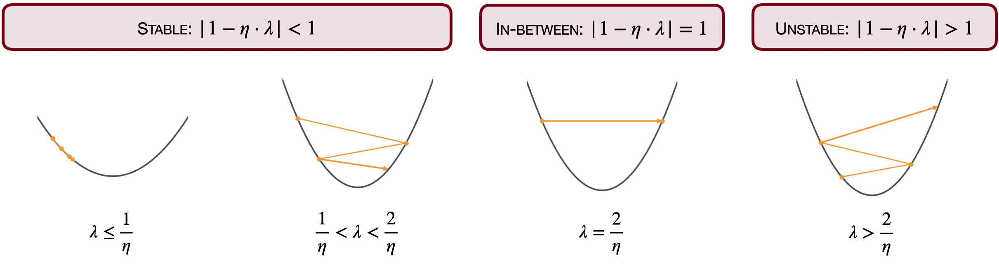
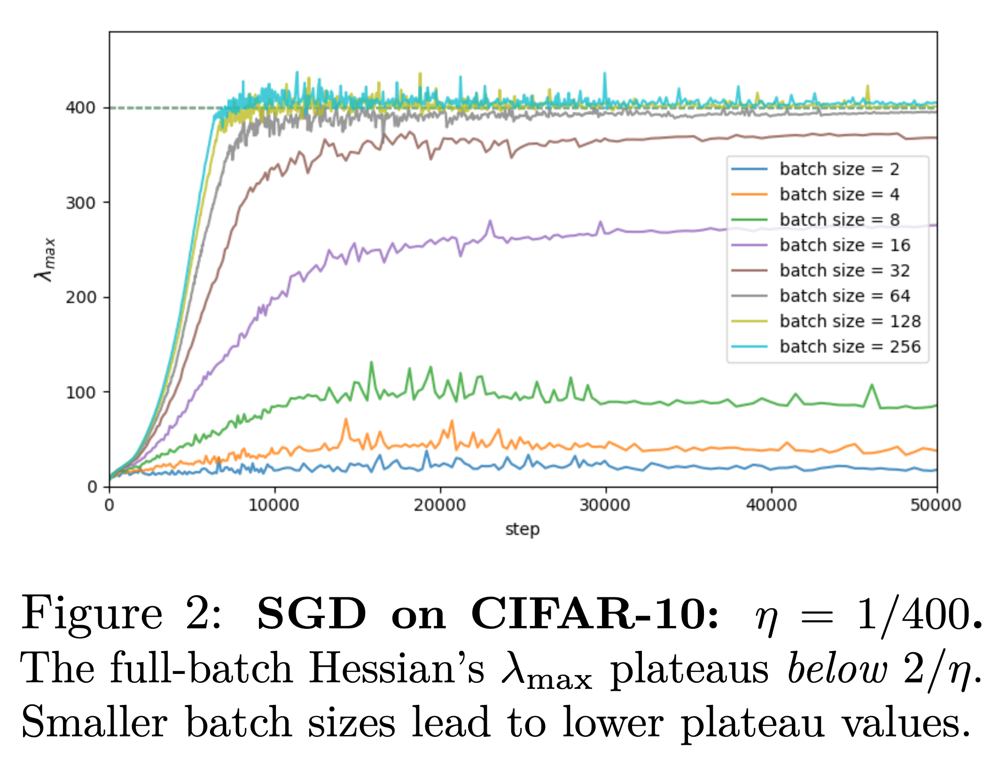

# Edge of (Stochastic) Stability made simple — Part I
Date: Feb 18, 2026
By Pierfrancesco Beneventano

Based on **[Edge of Stochastic Stability (Andreyev and Beneventano, arXiv:2412.20553)](https://arxiv.org/abs/2412.20553)**; correspondence to [Pierfrancesco Beneventano](https://pierbeneventano.github.io/), [pierb@mit.edu](mailto:pierb@mit.edu).

<aside>
<strong><em>What this post is about</em></strong>
<em>I remember in high school manually checking the stationary points to locate minima and maxima. Later in undergrad I was told a comforting mantra: go down (follow $-\nabla L$) and you end up at a stationary point.</em>

<em>This post is about these intuitions breaking for neural networks: how and why.</em>
</aside>

---

***Acknowledgements / lineage.*** I’m very grateful to [Jeremy Cohen](https://jmcohen.github.io/), [Alex Damian](https://alex-damian.github.io/), and [Arseniy Andreyev](https://scholar.google.com/citations?user=CI36v0sAAAAJ&hl=en) for many discussions over the years that shaped how I think about stability-limited training and curvature. For an intuitive introduction to Edge of Stability, I especially recommend their writing at [https://centralflows.github.io/](https://centralflows.github.io/).

***Conceptual Map*** **(where this is going):** Inspired by the structure of those posts, I'll split this into three parts:

**Part I:** a quick refresher on (full-batch) Edge of Stability (EOS) to set the scene for what comes next.

**Part II (the mini-batch case)**: what changes for SGD, why “λ_max hits 2/η” is the *wrong* diagnostic, what diagnostics we came up with, and the Edge of *Stochastic* Stability (EoSS).

**Part III:** practical implications (hyperparameters, modeling SGD, and what this perspective changes).

---

# Part I: A crash course on (full-batch) Edge of Stability

In this part I introduce the phenomenon and what I believe are the two key mechanisms—which we’ll use as the springboard for the mini-batch story of **Part II**.

Importantly, this part is ***not*** based on my work but on the work of [Jeremy Cohen](https://jmcohen.github.io/), [Alex Damian](https://alex-damian.github.io/) and coauthors:

- [Gradient Descent on Neural Networks Typically Occurs at the Edge of Stability (Cohen et al., 2021)](https://arxiv.org/abs/2103.00065)
- [Self-Stabilization: The Implicit Bias of Gradient Descent at the Edge of Stability (Damian et al., 2022)](https://arxiv.org/abs/2209.15594)

## Where does GD stop?

On a quadratic $L(\theta) = \frac{\lambda}{2} \theta^2$, $\lambda>0$, we can track it exactly: gradient descent (GD) with step size $\eta > 0$ has the following update: 

$$
\theta_{t+1} = (1 - \eta \lambda) \theta_t .
$$

Thus $\theta_t \to 0$ exponentially fast… or maybe not. 

The behavior is completely determined by the multiplier $|1 - \eta \lambda|$.
When $|1- \eta \lambda| < 1$ (equivalently $0 < \eta < 2/\lambda$), the iterates converge to $0$ exponentially fast.

However, iterates could also diverge (for $\eta > 2/\lambda$) or oscillate in a period-2 orbit (for $\eta = 2/\lambda$), jumping between initialization $\theta_0$ and $-\theta_0$.

Classical optimization treats the latter two regimes as *‘wrong step sizes’*. Surprisingly, modern neural nets often train successfully *at* this $2/\lambda$ stability boundary—and that’s the story behind EOS.

## Edge of Stability

[Jeremy](https://jmcohen.github.io/) and co-authors ([Cohen et al., 2021](https://arxiv.org/abs/2103.00065)) made (at least) 2 sharp observations:

1. *As the loss goes down, sharpness (top-eigenvalue of the Hessian, our $\lambda$ above) increases.*
2. *When it reaches $2/\eta$ it stabilizes there; the loss keeps decreasing on average, but becomes non-monotone (oscillatory).*

<!-- *Gifs inspired by those on* [Jeremy Cohen's website](https://jmcohen.github.io/). -->

---

## Mechanism 1: the instability threshold is when a power iteration happens

A major insight is that for self-stabilization to happen in full-batch algorithms, the algorithm needs to locally diverge, thus becomes unstable. Precisely, an EoS and AEoS is present when:

<aside>
💡 Locally, one direction expands while the others contract—so the update aligns with the sharpest direction like a power iteration.
</aside>

This is the mechanism of the oscillations we see in the train loss, and the main submechanism in the self-stabilization phenomenon above, the fact that as we enter the red—unstable—area, GD works as a power iteration along the direction of “high curvature”, precisely

$$
\theta_{t+1} = (I - \eta \mathcal{H}(\theta_t))\cdot \theta_t.
$$

## Mechanism 2: Progressive Sharpening causes Self-stabilization

How is this possible, why is this the case unlike all the other optimization domains?

Arguably the only thing that changes and the only one that the gifs above are showing is that

$$
\lambda \text{ increases!}
$$

What is called ***progressive sharpening***: indeed, in observation 1 we saw that as the loss goes down the Hessian goes up!

And what about observation 2?

[Alex](https://alex-damian.github.io/), [Eshaan](https://eshaannichani.com/), and [Jason](https://jasondlee88.github.io/) ([Damian et al., 2022](https://arxiv.org/abs/2209.15594)) showed that also that is a consequence of progressive sharpening!

<aside>
💡 Progressive Sharpening provides (1.) the drift toward instability <strong>and also</strong> (2.) the push-back when local divergence happens, which yields hovering near the edge.
</aside>

To build up a mental picture of this, let’s pick the smaller landscape in which progressive sharpening is present: there are 2 variables, the gradient (going down inside the screen) points in a direction in which the Hessian grows (in the perpendicular direction).

We would expect here that the dynamics quickly reaches the river and flows towards sharper and sharper canyons, and this is what happens in the blue area (stable, $\lambda \leq 2/\eta$). By going down the dynamics enters the red area (unstable, $\lambda > 2/\eta$) and it diverges along the perpendicular direction (see GIF below).

Actually... this is not the case and the gif above was straight made-up. The fact that it locally diverges implies that it goes in areas where the gradient points backward (because the gradient is perpendicular to the level lines and the level lines are curved, since going forward the landscape is sharpening!). Thus the trajectory jumps back in the blue area and the chaotic cycle restarts:

*Gifs inspired by those on* [Alex Damian's website](https://alex-damian.github.io/).

We thus saw that (1) progressive sharpening is not just an observation in early training—it is the observation that explains the whole phenomenon. The stabilization itself is ***caused*** by progressive sharpening.

<aside>
💡 <em>Progressive Sharpening is the main actor and cause of all these related observations</em>
</aside>

In particular progressive sharpening is what causes ***Mechanism 2*** (the self-stabilization phenomenon), when ***Mechanism 1*** (the local divergence) kicks in.

So:

1. We see oscillations in the loss because of this local instability (locally the loss is increasing).
2. We see oscillations (self-stabilization) in the Hessian because of the third derivative pushing back.

---

## Implications and Meaning

What we said so far implies that:

<aside>
💡 <em>The loss locally increases monotonically</em> ⟹ <em>Descent-type lemmas do not apply.</em> Thus not only are the landscapes of neural networks non-convex, there is another stronger ingredient of convergence proofs that fails: <em>the Descent lemma!</em>
</aside>

And with this also most arguments about location of convergence are broken, as long as most arguments that have been proposed by the community which hold under bounds on the Hessian.

Importantly, this is a further argument (the first in the literature being the proofs of implicit regularization) which shows a **principle that mathematicians have to follow** when working with neural network theory:

<aside>
💡 One needs to expand in Taylor deeper than order 2 to understand what is going on in training.
</aside>

Cool, not only, this gives the first such argument supporting what practitioners always saw:

<aside>
💡 Location of convergence (thus performance?) qualitatively depend on the hyper parameters chosen. They do not just influence speed of descent, they set where you go.
</aside>

Moreover, Edge of Stability is a mechanism that surprisingly shows that:

<aside>
💡 GD is implicitly making use of higher order derivatives (Hessian through the power iteration, which also unlocks the use of third derivative through the self-stabilization process).
</aside>

---

## Next what? Towards SOTA Optimizers (mini-batch)

All the results we saw so far hold for full-batch algorithms, precisely, GD, preconditioned/accelerated GD, full-batch RMSProp, full-batch Adam.

***Neural networks are trained in a mini-batch fashion, do mini-batch algorithms behave differently?***

Seemingly, they do behave differently as observed since [Keskar et al. (2016)](https://arxiv.org/pdf/1609.04836), which was the observation that arguably started the research topic of *“inductive bias of optimization algorithms”* and that is the first paper, to my knowledge showing different hyper parameters go to qualitatively different minima. Precisely, they show, smaller mini-batches go to flatter minima (see our picture below)!

However, for instance, the loss of SGD always oscillates through the training, so do we care about oscillations or instability?

The punchline is, see **Part II**: for SGD, **loss oscillations are not diagnostic**, and $\lambda_{\max}$ of the full-batch Hessian typically does *not* track the relevant stability threshold—so we need a different, mini-batch-native notion of “edge.”

To bridge with the next parts, the questions here are:

*How to find out whether other algorithms are working at their own version of EoS, what is that, and what are the implications?* → **Part II: The mini-batch case**

*Which implications carry and which new ones are there? Is this even interesting, apart the mathematical beauty of the description?* → **Part III: Getting practical**
